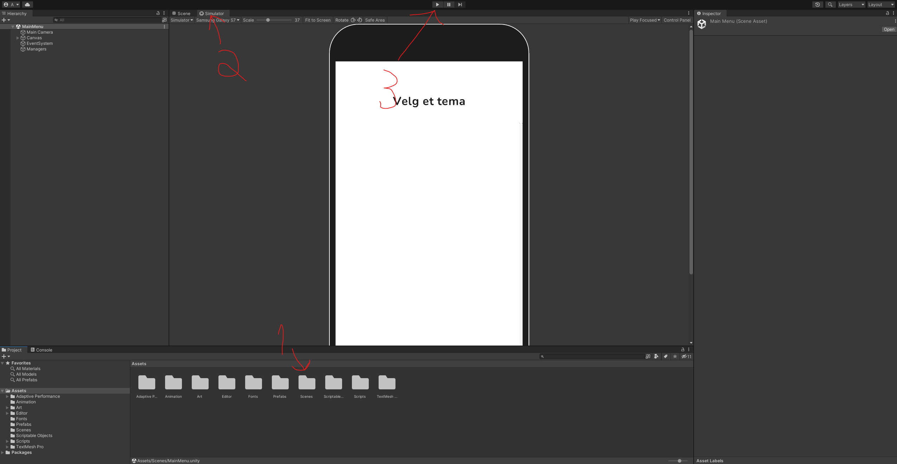
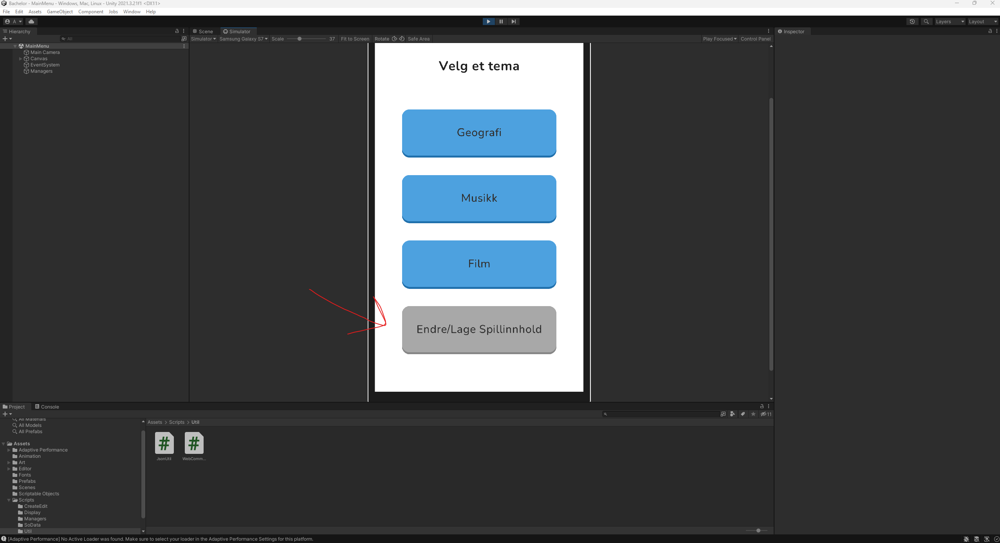

Install docker and create a local docker container for the mysql database using:

docker run --hostname=c217f3bd6ad4 --mac-address=02:42:ac:11:00:02 --env=MYSQL_ROOT_PASSWORD=secret --env=PATH=/usr/local/sbin:/usr/local/bin:/usr/sbin:/usr/bin:/sbin:/bin --env=GOSU_VERSION=1.14 --env=MYSQL_MAJOR=8.0 --env=MYSQL_VERSION=8.0.29-1debian10 --volume=/var/lib/mysql -p 3306:3306 --restart=no --runtime=runc -d mysql

After the container is up and running, open the java project (\bachelor-project-2023\seriousGameBackend\) and do "*mvn install*". After that do "*mvn spring-boot:run*" to run the backend. Questions and levels are generated from the TestDataInitializer.java file when the program starts.

Everything is then ready for the application (\bachelor-project-2023\Bachelor\) to run in unity (Recommended to use unity editor version 2021.3.21f1) or a local build of the project. The container is running on port 3306 and the backend on port 8080. The backend attempts to connect to localhost:3306 and will not start if the docker container is not already up and running. The unity project gets all its data through the backend.

This can be changed in application.properties for the java project, and in WebCommunicationUtil.cs in the unity project.

When running the unity project navigate to scenes (1) and enter the MainMenu scene. in the upper center of the screen select simulator (2) before starting the application with the play button (3).

To change the content of the questions press the button that says "Endre/Lage Spillinnhold" in the main menu.

Here the subjects and their underlying levels and questions can be edited/deleted/added. (it is recommended to press the save button after every change)